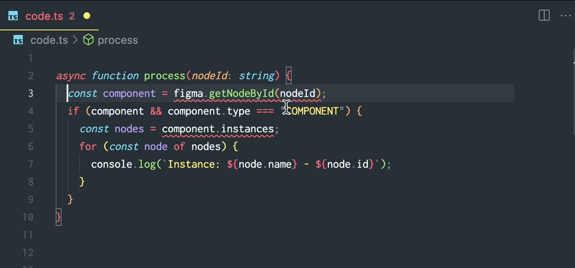

# eslint-plugin-figma-plugins

This repository defines [typescript-eslint](https://typescript-eslint.io/) rules for [Figma plugin development](https://www.figma.com/plugin-docs/).

This tool helps you stay up to date with best practices and deprecations in the Figma Plugin API. You can use it to help identify, and in many cases automatically fix, issues in your plugin code. Like any ESLint plugin, it integrates with IDEs like VSCode to provide inline warnings and quick-fix functionality.

### A quick look



## Installation

### Dependencies

This linter requires TypeScript, ESLint, typescript-eslint, and the Figma Plugin API type definitions. To install all of these, run:

```
npm install -D typescript eslint@8 @typescript-eslint/parser@6 @typescript-eslint/eslint-plugin@6 @figma/plugin-typings
```

#### Notes on peer dependency versions

- This plugin is not yet compatible with ESLint 9. Once [typescript-eslint](https://github.com/typescript-eslint/typescript-eslint) has been [upgraded to support ESLint 9](https://github.com/typescript-eslint/typescript-eslint/pull/9002), we'll update this README with example configurations that use the new ESLint 9 flat configs.
- This plugin has only been tested with typescript-eslint version 6.

### Install the ESLint plugin package

```
npm install -D @figma/eslint-plugin-figma-plugins
```

### Configure eslint

Configure typescript-eslint as normal using [these instructions](https://typescript-eslint.io/getting-started#step-1-installation).

Next, update your ESLint config's `extends` array to include the `plugin:@figma/figma-plugins/recommended` ruleset. We also recommend the following rulesets:

- `eslint:recommended`,
- `plugin:@typescript-eslint/recommended`

To work with TypeScript code, ESLint also requires the following parser settings:

```
{
  ...
  parser: '@typescript-eslint/parser',
  parserOptions: {
    project: './tsconfig.json',
  },
  ...
}
```

Here's a full example of `.eslintrc.js`:

```
/* eslint-env node */
module.exports = {
  extends: [
    'eslint:recommended',
    'plugin:@typescript-eslint/recommended',
    'plugin:@figma/figma-plugins/recommended',
  ],
  parser: '@typescript-eslint/parser',
  parserOptions: {
    project: './tsconfig.json',
  },
  root: true
}
```

### Restart the ESLint server

If you've run `npm install` and updated to a newer version of this package, remember to restart your IDE. In VSCode, you can restart the ESLint server independently by opening the command palette and choosing "Restart ESLint Server".

## Usage

### Linting and autofixing

You can lint your project using these rules by running

```
npx eslint ./path/to/source
```

Some rules provide autofixes, which you can run using `--fix`.

```
npx eslint --fix ./path/to/source
```

Autofixes are also available via some IDEs.

### VSCode

To use ESLint with VSCode, see the [ESLint VSCode extension](https://marketplace.visualstudio.com/items?itemName=dbaeumer.vscode-eslint). This extension will show rule violations inline, as well as provide opportunities to run autofixes directly in the IDE.

## Rules

<!-- begin auto-generated rules list -->

💼 Configurations enabled in.\
⚠️ Configurations set to warn in.\
👍 Set in the `recommended` configuration.\
🔦 Set in the `recommended-problems-only` configuration.\
🔧 Automatically fixable by the [`--fix` CLI option](https://eslint.org/docs/user-guide/command-line-interface#--fix).

| Name                                                                                                                                       | Description                                                            | 💼    | ⚠️ | 🔧 |
| :----------------------------------------------------------------------------------------------------------------------------------------- | :--------------------------------------------------------------------- | :---- | :- | :- |
| [await-requires-async](docs/rules/await-requires-async.md)                                                                                 | Require functions that contain `await` to be `async`                   | 👍 🔦 |    | 🔧 |
| [ban-deprecated-id-params](docs/rules/ban-deprecated-id-params.md)                                                                         | Ban use of deprecated string ID parameters                             | 👍 🔦 |    | 🔧 |
| [ban-deprecated-sync-methods](docs/rules/ban-deprecated-sync-methods.md)                                                                   | Ban use of deprecated synchronous methods                              | 👍 🔦 |    | 🔧 |
| [ban-deprecated-sync-prop-getters](docs/rules/ban-deprecated-sync-prop-getters.md)                                                         | Ban use of deprecated synchronous property getters                     | 👍 🔦 |    | 🔧 |
| [ban-deprecated-sync-prop-setters](docs/rules/ban-deprecated-sync-prop-setters.md)                                                         | Ban use of deprecated synchronous property getters                     | 👍 🔦 |    | 🔧 |
| [constrain-proportions-replaced-by-target-aspect-ratio-advice](docs/rules/constrain-proportions-replaced-by-target-aspect-ratio-advice.md) | Warns against using constrainProportions in favor of targetAspectRatio |       | 👍 |    |
| [dynamic-page-documentchange-event-advice](docs/rules/dynamic-page-documentchange-event-advice.md)                                         | Advice on using the `documentchange` event                             |       | 👍 |    |
| [dynamic-page-find-method-advice](docs/rules/dynamic-page-find-method-advice.md)                                                           | Advice on using the find*() family of methods                          |       | 👍 |    |

<!-- end auto-generated rules list -->

### Contributing

Please see [CONTRIBUTING.md](./CONTRIBUTING.md)